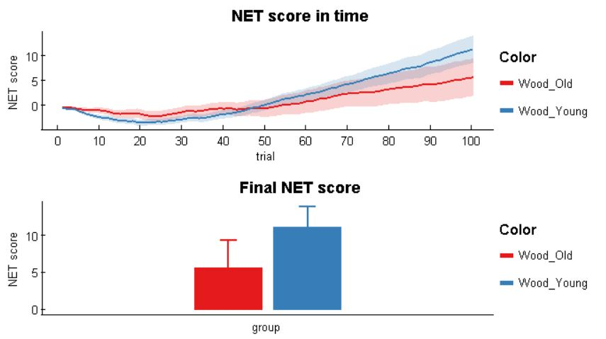
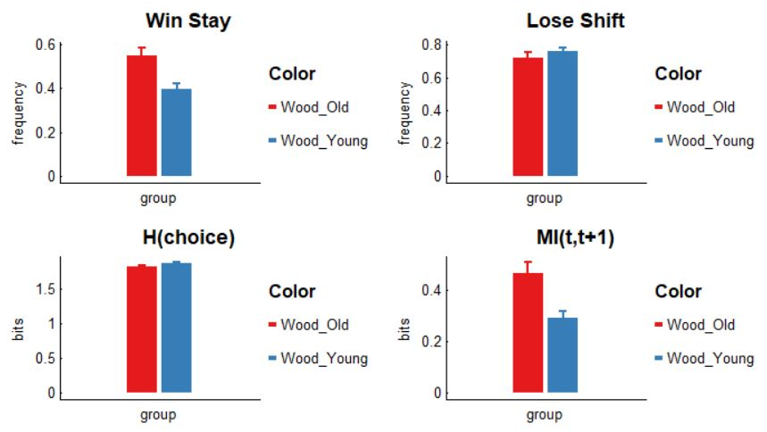
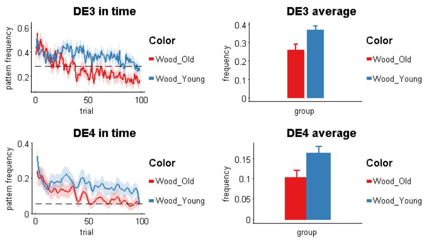
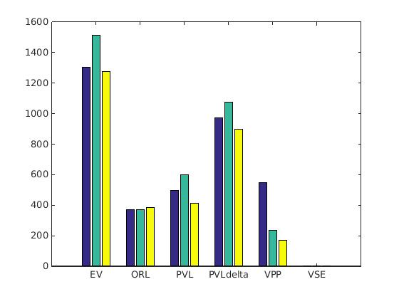
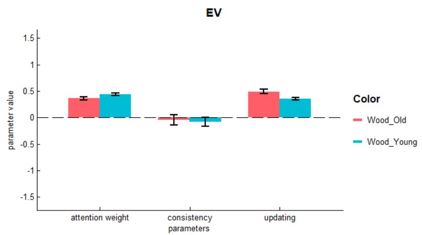
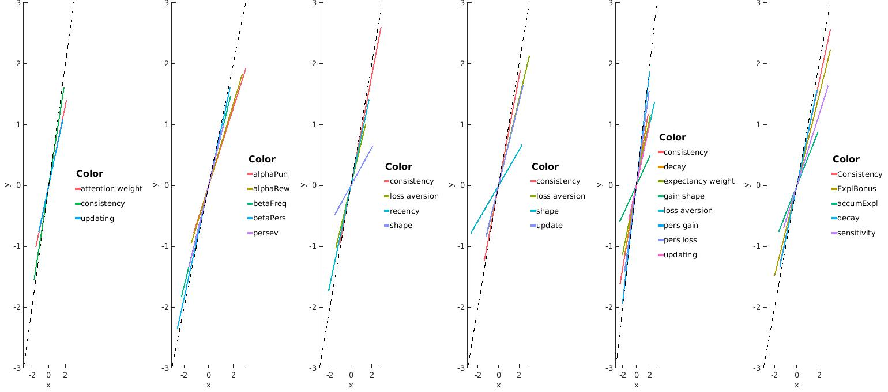

# igt-toolbox

The purpose of the igt-toolbox is to facilitate the analysis/reanalysis of data from the standard version of the [Iowa Gambling Task](https://en.wikipedia.org/wiki/Iowa_gambling_task).

Before discussing the specificities of the toolbox, it must be noted that the toolbox relies heavily on two excellent and well-documented Matlab packages:
1. The [VBA toolbox](https://mbb-team.github.io/VBA-toolbox/) developed by Jean Daunizeau and Lionel Rigoux. Almost all model fitting and model comparison procedures included in the igt-toolbox depend on VBA (for Variational Bayes Analysis).
2. [Gramm](https://github.com/piermorel/gramm) developed by Pierre Morel. Many data visualization procedures depends on Gramm.

Note that these two resources are included in the igt-toolbox itself. However, it can be a good idea to update them from time to time. Alternatively, if they are already in your Matlab path, you can delete their respective folders (i.e Tools/VBA and Tools/OTHERS/gramm-master)

Besides citing the original manuscript of the IGT toolbox, please also acknowledge these two tools in your manuscripts:

> * J. Daunizeau, V. Adam, L. Rigoux (2014), VBA: a probabilistic treatment of nonlinear models for neurobiological and behavioural data. PLoS Comp Biol 10(1): e1003441.
> * Morel, (2018). Gramm: grammar of graphics plotting in Matlab. Journal of Open Source Software, 3(23), 568.

## installation

This toolbox needs Matlab. It was developed and tested on versions 2014b and 2017a, using Windows and Linux, but it should work on ealier versions and other platforms as well.

**Option 1**: clone this repository using the command ```git clone https://github.com/romainligneul/igt-toolbox.git```

**Option 2**: download this repository and extract it somewhere on your computer

Then, you are ready to go.

## convert your data to the appropriate format

The toolbox requires that IGTdata is converted in a Matlab structure of the following form, 1 being the id number of a given subject:

```Matlab
data{1}.id = 1                  % a single integer corresponding to the id number of the subject
data{1}.cond = 0                % a single integer corresponding to the id number of the group or condition
data{1}.cond_label = 'Control'  % a single string labeling the group or condition_number
data{1}.trial=[1:100]'          % a 100 by 1 array corresponding to the indice of each trial
data{1}.deck=[3; 2; 4; etc]     % a 100 by 1 array corresponding to the deck selected on each trial. 1 corresponds to deck A, 2 corresponds to deck 2, etc.
data{1}.win=[25, 100, 25, etc]  % a 100 by 1 array corresponding to the gain associated with the outcome of each trial
data{1}.lose=[-200, 0, 0, etc]  % a 100 by 1 array corresponding to the loss associated with the outcome of each trial (indifferently negative or positive)
data{1}.rt = [0.73, 1.12, 0.95, etc]
                                % optional: a 100 by 1 array corresponding to the decision time of the subject in this specific trial
```

This data structure should be saved in a file named **IGTdata.mat**, within a folder whose name is informative.

In the folders IGTdata/Ahn2014_addiction and IGTdata/opendata504subjects contain 2 scripts named convert_xls.m automatizing this I/O process. However, you may need to write a custom script adapted to your raw data files.

## check basic behavioral metrics

Once you have converted your data, it is time to have a first look at it without involving any computational modeling step.

To do so, you should use the script **IGT_Toolbox_1_AnalyzeRawBehavior.m**

After running it, you will have to:
1. Select the folder containing the **IGTdata.mat** file of interest
2. Select the group(s) or condition(s) to be included in the statistical analysis
3. Indicate whether the different groups/conditions reflect repeated (same subjects tested several times) or independent measurements (different subjects tested one time).
4. Indicate whether you want to plot all your data or just the subset of the groups/conditions you have selected.

Once computations are performed, a series of figures will appear on the screen.


These variables is also contained in a structure named **stats_all** (which appears in the workspace):
1. *Netscore*: a variable corresponding to the number of "advantageous" choices (C or D)  minus the number of "disadvantageous" choices (A or B)



2. *Win Stay (WS) and Lose Shift (LS)*: two variables reflecting the proportion of trials in which participants selected again the same deck after an outcome which involved no loss (WS) and the proportion of trials in which participants selected a different deck after an outcome involving a loss (LS)

 *H(choice)*: a variable reflecting the entropy of the entire choice sequence of the subject. The maximal value of 2 (bits) implies that the participant explored all decks evenly. The lowest the value the more uneven the exploration of the different decks. The minimal value of 0 implies that the participant constantly selected the same deck.

 *MI_successive_choices*: a variable reflecting the statistical mutual information of successive choices. Higher values implies that one could predict to some extent the choice in trial *t+1* by observing the choice made in trial *t*. This variable can thus be seen as reflecting the autocorrelation of successive choices.
 

3. *DE3* and *DE4*: the model-free measures of directed exploration discussed in the paper accompanying the igt-toolbox. They correspond respectively to the frequency at which participants selected 3 different decks over 3 consecutive trials (DE3: theoretic chance level:0.3333) or 4 different decks over 4 consecutive trials (DE4: theoretic chance level at 0.0938). Note that the chance levels reported as dashed lines are empirical (i.e based on permutation).


*Note that these figures correspond to the data comparing old and young adults' behavior in the IGT, as reported in the paper accompanying this toolbox*.


Importantly, the structure **stats_all** contains the raw variables, their means and standard deviations *per group/condition*, as well as the statistical tests comparing the means of groups/conditions (parametric and non-parametric). Post-hoc tests are not included.

## fit the computational models

Once you have checked that your data looks reasonable, you can move forward and fit the 5 available models to your dataset. The Explore-Exploit model is fully described in the paper accompanying this toolbox, alongside a more compact description of the Expectancy-Valence model (EV), Prospect Valence Learning (PVL), PVL-Delta and Value Plus Perseverance (VPP) models. A full description of these models can be found in [Steingrover et al., 2016](http://psycnet.apa.org/doi/10.1037/dec0000040).

To do so, you will need to run the script **IGT_Toolbox_2_FitModels.m**, after adjusting a couple of parameters. This script is extensively commented. Its first part, which is the only one that most users will need to modify is reproduced below:

```Matlab
%% Data to be used
% in order to regenerate the dataset of the 504 subjects open dataset,
% indicate: load('IGTdata/opendata_1/opendata504subjects.mat');
% otherwise you can easily use your own dataset, provided that it is
% formatted correctly.
% If you have different groups define carefully data{}.cond and
% data{}.cond_label, as those will be used automatically in the next step
load('IGTdata/toydata_5subjects/IGTdata.mat');

%% General settings
% In theory, this section of the script is the only one that users
% unexperienced with computational modeling will modify.

% 1) Models that the toolbox is going to fit to your data
A.fit.models = {@run_EV, @run_EXPLORE, @run_PVL, @run_PVLdelta, @run_VPP};

% 2) Output_name (determines directory in which output of the fit is
% written
A.output_name = 'toydata_5subjects_flat';

% 3) Should the toolbox save all the information (can be >100mb per model)
% or just a summary? yes = 1 / no = 0
A.complete_save = 1;

% 4) Should the toolbox also simulate the models and perform parameter
% recovery? The recovery strategy consist in simulating all subjects based
% on the estimated parameters and check whether the algorithm  retrieve
% similar values.
% estimate = 0, estimate & recover = 1
A.simulate_and_recover = 1;

% 5) Should program use grid-computing? (qsub method / linux)
A.cluster_run = 0;

% 6) Types of priors to be used: 'informed','flat' or 'shrinkage'
% 'informed' priors are based on the distributions of parameters obtained
% from a open dataset of 504 subjects.
% 'flat' priors correspond to approximate uniform distributions
% 'shrinkage' priors correspond to priors of mean 0 and variance 1.
% It is good practice to compare the results obtained with each
% method. Note that 'informed' priors are based on the parameter distributions
% obtained by fitting the models to the open dataset of 504 subjects.
% Using them will diminish the risk of aberrant fit, but it may also
% reduce the ability to detect inter-individual differences.
A.fit.priors.type = 'flat';

%% Specific settings
% These settings offer more flexibility in the analysis.

% 1) Maximal number of subject on which the fit should be performed. Can be
% useful to use a small number (e.g 5) to check if everything works fine.
% However, in order to run the script IGT_Toobox_3_AnalyzeModels, you will
% need to analyze your whole dataset.
A.fit.maxsubjects = 5;

% 2) Number of trials in the version of the IGT tested. The standard
% version of the IGT has 100 trials, but some modified versions have 150 or
% 200.
A.fit.ntrials = 100;

% 3) It is common practice to divide feedbacks by 100 before fitting the
% IGT data. All results in Ligneul & Sescousse 2018 have been generated
% using such transform.
A.fit.divide_feeback = 100;

% 4) If you don't want to use the VBA toolbox or if you want to
% double-check your main results using a simpler gradient descent
% algorithm, you can set the option below to 1. In this case, the Matlab
% fminunc will be used (see Tools/OTHERS/VBA_fminunc_wrapper.m for more
% details). You can define the number of random initialization points (i.e
% initial parameters drawn randomly from their prior distributions) with
% the following line (nb. this parameter has a dramatic impact on
% computational time).
A.fit.fminunc = 0;
A.fit.options.fminunc_n_init_random = 20;

```

Note that this file is essentially a launcher script. It builds the data structure and runs a series of scripts contained in the model-specific subfolders in Tools/MODELS/.
Each of these subfolders contains a 3 files which entirely define a model:
* an *evolution function*, which determines how the hidden states of the model evolve in response to the outcomes of each choice.
* an *observation function*, which determines how the hidden states translate into a probability of choosing each deck.
* a *run_XX.m* script in which all the informations associated with a given model are determined (e.g. number and name of parameters, prior distributions over parameters). This script also manage the details of the model fitting, simulation and recovery procedures.

Again, all information relative to the procedure can be found on the website of the [VBA toolbox](https://mbb-team.github.io/VBA-toolbox/) as well as in the [seminal paper](https://doi.org/10.1371/journal.pcbi.1003441) describing it.

## analyze the modeling results

The final step consists in:
* comparing the different models in terms of goodness of fit, prediction accuracy and parameter recovery
* testing for significant statistical differences in parameters distribution from one group/condition to another.

To do so, you will need to run the script **IGT_Toolbox_3_AnalyzeModels.m**.

After running it, you will have to:
1. Select the folder containing the modeling analysis of interest
2. Select the models that you want to include in the model comparison and other analyses
3. Select the folder containing the dataset which was used for the fitting analysis
4. Select the group(s) or condition(s) to be included in the statistical analysis
5. Indicate whether the different groups/conditions reflect repeated (same subjects tested several times) or independent measurements (different subjects tested one time).
4. Indicate whether you want to plot all your data or just the subset of the groups/conditions you have selected.

Once computations are performed, a series of figures will appear on the screen.
1. A graphical representation of the cross-correlation of all parameters: the lower, the better, because high correlation amongst parameters (especially within a given model) implies that the cognitive meaning of these parameters' value is uncertain. Exact values can be found in the structure **cross_corr**.

2. A representation of model comparison treated as a fixed-effect, using the EE model as the reference model: positive values correspond to the information loss which would be incured by selecting a model different from EE. Note that a -2*X transformation is applied to every goodness of fit metric because the VBA toolbox outputs log-model evidences by default (see [here](http://mbb-team.github.io/VBA-toolbox/wiki/VBA-output-structure/) for an explanation). Exact values can be found in the variable **diff_metrics**.

3. A representation of model comparison treated as a random-effect (based on the function VBA_GroupBMC). Top-left panel represents the log-model evidences (based either on AIC, BIC or Free Energy) per subject per model. Top-right panel represents the probability of each model being the correct one, per subject. Bottom-left panel represents the exceedance probability that a given model is the most frequent within the population under scrutiny. Bottom-right panel represents the estimated frequencies of each model at the group level. NB: a separate figure is generated for each goodness of fit metric (i.e BIC, AIC, Free Energy). All information about Bayesian Model Comparison can be found in the structure **post_F**, **out_F**, **post_BIC**, **out_BIC**, **post_AIC** and **out_AIC**.

4. A representation of the mean +/- sem value of all parameters of a given model. The color code correspond to the group/condition which have been selected for analysis. NB: a separate figure is generated for each model (here, Expected Valence). All means, SD, recovery values and statistical tests related to models' parameters can be found in the structures **stats_theta** (for parameters of the evolution functions) and **stats_phi** (for parameters of the observation functions)

5. A graphical representation of parameter recovery. The dashed line represents the perfect equivalence between actual parameters (in x, obtained by fitting the real dataset) and recovered parameters (in y, obtained by fitting the simulated dataset). Actual and recovered parameters for each individual can be found in the structures **theta_fitsim** and **phi_fitsim** (first column: actual parameters)

